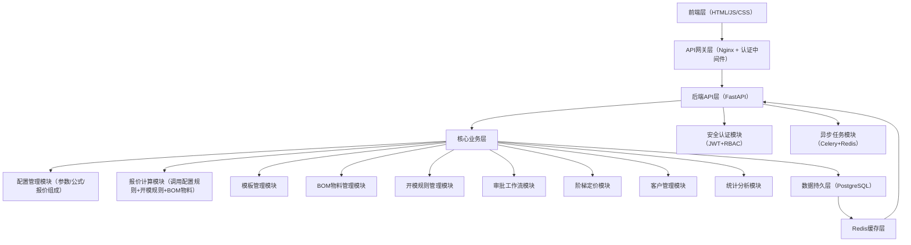

# 全自定义自动报价系统V2.0（优化版）

## 一、系统核心设计（通用化核心）

### 1.1 核心目标

让用户（管理员）无需修改代码，即可自行配置「产品参数、计算公式、报价组成、BOM物料、开模规则」，业务员仅需选择配置好的模板，输入参数即可自动报价。整体架构仍采用前后端分离（Python+FastAPI+PostgreSQL+原生前端），重点新增「配置模块、BOM物料模块、开模规则模块」，实现全流程自定义，适配小批量开模、BOM物料灵活引用场景。

### 1.2 通用化设计核心思路

**基础能力层：**

- 参数自定义：用户可新增任意产品类型，为每种产品配置专属参数（如尺寸、基重、淋膜量、厚度等，支持数字/文本/下拉类型）；
- 公式自定义：用户可通过可视化/文本方式，为产品配置核心计算公式（如克重、单耗、物料成本公式），支持参数变量、基础运算、函数调用、BOM物料引用；
- 报价组成自定义：用户可自由配置报价的成本项（如物料成本、工艺成本、运费、税费、利润、开模费），每个成本项可绑定自定义计算规则，开模费支持按订单数量阈值触发；
- 模板化管理：将「产品参数+计算公式+报价组成+BOM物料+开模规则」封装为报价模板，业务员直接选择模板、输入参数，系统自动执行计算（含开模费判断、BOM物料引用），无需关注底层逻辑；
- BOM物料灵活引用：新增BOM物料管理，支持物料分类、物料单价维护，公式可直接引用BOM物料单价/用量，实现物料成本灵活计算；
- 开模费规则自定义：支持配置开模费阈值（如5000数量以下）、开模费金额/计算公式，系统自动根据订单数量判断是否触发开模费，无需人工干预。

**增强能力层（V2.0新增）：**

- 阶梯定价支持：支持配置不同数量区间的价格，实现数量越多单价越低的阶梯定价；
- 审批工作流：支持设置审批规则（如金额阈值、利润率阈值），系统自动判断是否需要审批；
- 报价有效期管理：支持设置报价有效期，自动提醒报价过期；
- 客户分级定价：支持客户分级管理，为不同客户提供差异化定价策略；
- 历史快照机制：报价时自动保存价格快照，确保历史数据可追溯；
- 版本控制：报价模板支持版本管理，记录变更历史，支持回滚。

### 1.3 系统整体架构（新增配置层+BOM层+开模规则层+安全层+异步层）



**架构分层说明：**

1. **前端层**：原生HTML/JS/CSS实现的前端界面，负责用户交互
2. **API网关层**：Nginx反向代理 + 认证中间件，负责请求路由、负载均衡、SSL终结
3. **后端API层**：FastAPI服务，负责请求处理、响应格式化、接口版本管理
4. **安全认证模块**：JWT Token认证 + RBAC权限控制，负责用户身份验证和权限校验
5. **核心业务层**：包含9大业务模块，负责具体的业务逻辑处理
6. **异步任务模块**：Celery + Redis，负责耗时计算、批量处理、定时任务
7. **数据持久层**：PostgreSQL主数据库 + Redis缓存，负责数据存储和缓存

## 二、前置准备（开发环境+数据库设计）

### 2.1 开发环境搭建

```bash
# 安装核心依赖（FastAPI+PostgreSQL驱动+公式解析+Excel导出+异步任务+缓存）
pip install fastapi uvicorn psycopg2-binary pandas openpyxl sympy python-multipart
pip install redis celery pydantic-settings python-jose passlib[bcrypt]
pip install pytest pytest-asyncio httpx

# 生产环境额外依赖
pip install gunicorn nginx docker-compose
```

**依赖说明：**

- `fastapi` + `uvicorn`：Web框架和ASGI服务器
- `psycopg2-binary`：PostgreSQL数据库驱动
- `pandas` + `openpyxl`：数据处理和Excel导出
- `sympy`：安全的数学公式解析（替代eval，避免安全风险）
- `redis` + `celery`：异步任务队列
- `pydantic-settings`：配置管理
- `python-jose` + `passlib`：JWT认证和密码加密
- `pytest` + `httpx`：单元测试和API测试

### 2.2 数据库表设计（适配PostgreSQL，V2.0优化版）

#### 2.2.1 核心配置表

```sql
-- 1. 产品类型表（用户可新增产品，如淋膜纸片、底纸、覆膜纸等）
CREATE TABLE product_type (
  type_id SERIAL PRIMARY KEY COMMENT '产品类型ID',
  type_name VARCHAR(50) NOT NULL UNIQUE COMMENT '产品类型名称（如淋膜纸片）',
  type_desc TEXT COMMENT '产品描述',
  is_active INT DEFAULT 1 COMMENT '是否启用（1=启用，0=禁用）',
  create_by VARCHAR(20) DEFAULT 'system' COMMENT '创建人',
  create_time TIMESTAMP DEFAULT CURRENT_TIMESTAMP,
  update_time TIMESTAMP DEFAULT CURRENT_TIMESTAMP
);

-- 2. 参数配置表（用户为每种产品配置专属参数，如长度、基重等）
CREATE TABLE param_config (
  param_id SERIAL PRIMARY KEY COMMENT '参数ID',
  type_id INT NOT NULL COMMENT '关联产品类型ID',
  param_name VARCHAR(50) NOT NULL COMMENT '参数名称（如长度、基重）',
  param_type VARCHAR(20) NOT NULL COMMENT '参数类型（number：数字/text：文本/select：下拉）',
  param_unit VARCHAR(20) COMMENT '参数单位（如cm、g/㎡）',
  param_options JSONB COMMENT '下拉参数的选项（JSON格式，如["单面","双面"]）',
  is_required INT DEFAULT 1 COMMENT '是否必填（1=是，0=否）',
  default_value VARCHAR(50) COMMENT '默认值',
  min_value FLOAT COMMENT '最小值（V2.0新增）',
  max_value FLOAT COMMENT '最大值（V2.0新增）',
  validation_rule VARCHAR(255) COMMENT '自定义校验规则（V2.0新增）',
  display_order INT DEFAULT 0 COMMENT '显示顺序',
  create_time TIMESTAMP DEFAULT CURRENT_TIMESTAMP,
  update_time TIMESTAMP DEFAULT CURRENT_TIMESTAMP,
  FOREIGN KEY (type_id) REFERENCES product_type(type_id) ON DELETE CASCADE
);

-- 3. 公式配置表（用户自定义计算公式，如克重、物料成本公式，支持引用BOM物料）
CREATE TABLE formula_config (
  formula_id SERIAL PRIMARY KEY COMMENT '公式ID',
  formula_name VARCHAR(50) NOT NULL COMMENT '公式名称（如单张克重公式）',
  formula_expr TEXT NOT NULL COMMENT '公式表达式（如"(length*width/10000)*base_weight"，支持引用bom_price）',
  formula_desc TEXT COMMENT '公式描述',
  param_ids JSONB NOT NULL COMMENT '关联的参数ID（JSON格式，如[1,2,3]）',
  bom_ids JSONB COMMENT '关联的BOM物料ID（JSON格式，如[1,2]，可选）',
  result_unit VARCHAR(20) COMMENT '计算结果单位（如g、元）',
  is_active INT DEFAULT 1 COMMENT '是否启用',
  version INT DEFAULT 1 COMMENT '版本号（V2.0新增）',
  create_time TIMESTAMP DEFAULT CURRENT_TIMESTAMP,
  update_time TIMESTAMP DEFAULT CURRENT_TIMESTAMP
);

-- 4. 工艺配置表（用户可新增任意工艺，自定义加价规则）
CREATE TABLE process_config (
  process_id SERIAL PRIMARY KEY COMMENT '工艺ID',
  process_name VARCHAR(50) NOT NULL COMMENT '工艺名称（如淋膜、模切）',
  add_type VARCHAR(20) NOT NULL COMMENT '加价方式（area/unit/ratio：按面积/按单张/按比例）',
  add_expr TEXT NOT NULL COMMENT '加价计算公式（如"total_area*0.5"）',
  min_order INT DEFAULT 0 COMMENT '起订量',
  is_active INT DEFAULT 1 COMMENT '是否启用',
  create_time TIMESTAMP DEFAULT CURRENT_TIMESTAMP,
  update_time TIMESTAMP DEFAULT CURRENT_TIMESTAMP
);

-- 5. 报价组成配置表（用户自定义报价的成本项，新增开模费项）
CREATE TABLE quote_component (
  component_id SERIAL PRIMARY KEY COMMENT '成本项ID',
  component_name VARCHAR(50) NOT NULL COMMENT '成本项名称（如物料成本、工艺成本、开模费）',
  calc_expr TEXT NOT NULL COMMENT '成本项计算公式（如"total_weight_ton*price_per_ton"，开模费可填固定值或公式）',
  component_type VARCHAR(20) NOT NULL COMMENT '成本项类型（material/process/other/mold：物料/工艺/其他/开模费）',
  is_required INT DEFAULT 1 COMMENT '是否必选（1=是，0=否，开模费可设为0，按规则触发）',
  display_order INT DEFAULT 0 COMMENT '显示顺序',
  is_active INT DEFAULT 1 COMMENT '是否启用',
  create_time TIMESTAMP DEFAULT CURRENT_TIMESTAMP,
  update_time TIMESTAMP DEFAULT CURRENT_TIMESTAMP
);

-- 6. 报价模板表（封装「产品参数+公式+报价组成+工艺+BOM物料+开模规则」，业务员直接使用）
CREATE TABLE quote_template (
  template_id SERIAL PRIMARY KEY COMMENT '模板ID',
  template_name VARCHAR(50) NOT NULL COMMENT '模板名称（如淋膜纸片报价模板）',
  type_id INT NOT NULL COMMENT '关联产品类型ID',
  formula_ids JSONB NOT NULL COMMENT '关联的公式ID（JSON格式，如[1,2]）',
  component_ids JSONB NOT NULL COMMENT '关联的报价组成ID（JSON格式，如[1,2,3,4,5]）',
  process_ids JSONB COMMENT '默认关联的工艺ID（JSON格式，可选）',
  bom_ids JSONB COMMENT '默认关联的BOM物料ID（JSON格式，可选）',
  mold_rule_id INT COMMENT '关联的开模规则ID（可选，无则不触发开模费）',
  tiered_pricing_ids JSONB COMMENT '关联的阶梯定价规则ID（V2.0新增）',
  template_desc TEXT COMMENT '模板描述',
  version INT DEFAULT 1 COMMENT '模板版本号（V2.0新增）',
  status VARCHAR(20) DEFAULT 'draft' COMMENT '模板状态（draft/published/archived，V2.0新增）',
  change_log TEXT COMMENT '变更日志（V2.0新增）',
  create_by VARCHAR(20) DEFAULT 'system' COMMENT '创建人',
  create_time TIMESTAMP DEFAULT CURRENT_TIMESTAMP,
  update_time TIMESTAMP DEFAULT CURRENT_TIMESTAMP,
  FOREIGN KEY (type_id) REFERENCES product_type(type_id) ON DELETE CASCADE,
  FOREIGN KEY (mold_rule_id) REFERENCES mold_rule(rule_id) ON DELETE SET NULL
);

-- 7. 基础价格表（用户配置各类基础价格，如纸张单价、运费单价，可关联产品类型）
CREATE TABLE base_price (
  price_id SERIAL PRIMARY KEY COMMENT '价格ID',
  price_name VARCHAR(50) NOT NULL COMMENT '价格名称（如淋膜纸片单价）',
  type_id INT COMMENT '关联产品类型ID（可为空，通用价格）',
  price_value FLOAT NOT NULL COMMENT '价格值（如8500元/吨）',
  price_unit VARCHAR(20) NOT NULL COMMENT '价格单位（如元/吨、元/㎡）',
  valid_from TIMESTAMP DEFAULT CURRENT_TIMESTAMP COMMENT '生效开始时间（V2.0新增）',
  valid_to TIMESTAMP COMMENT '生效结束时间（V2.0新增）',
  is_active INT DEFAULT 1 COMMENT '是否启用',
  create_time TIMESTAMP DEFAULT CURRENT_TIMESTAMP,
  update_time TIMESTAMP DEFAULT CURRENT_TIMESTAMP,
  FOREIGN KEY (type_id) REFERENCES product_type(type_id) ON DELETE SET NULL
);

-- 8. BOM物料表（物料管理，支持灵活引用，适配物料成本计算）
CREATE TABLE bom_material (
  bom_id SERIAL PRIMARY KEY COMMENT 'BOM物料ID',
  bom_name VARCHAR(50) NOT NULL COMMENT '物料名称（如牛皮纸、PE淋膜料）',
  bom_type VARCHAR(30) NOT NULL COMMENT '物料类型（如基材、辅料、耗材）',
  bom_price FLOAT NOT NULL COMMENT '物料单价（如8500元/吨、12元/㎡）',
  price_unit VARCHAR(20) NOT NULL COMMENT '单价单位（如元/吨、元/㎡、元/kg）',
  bom_desc TEXT COMMENT '物料描述（如"300g牛皮纸，适合包装"）',
  valid_from TIMESTAMP DEFAULT CURRENT_TIMESTAMP COMMENT '生效开始时间（V2.0新增）',
  valid_to TIMESTAMP COMMENT '生效结束时间（V2.0新增）',
  is_active INT DEFAULT 1 COMMENT '是否启用（1=启用，0=禁用）',
  create_time TIMESTAMP DEFAULT CURRENT_TIMESTAMP,
  update_time TIMESTAMP DEFAULT CURRENT_TIMESTAMP
);

-- 9. 开模规则表（配置开模费阈值、金额，适配5000数量以下加开模费场景）
CREATE TABLE mold_rule (
  rule_id SERIAL PRIMARY KEY COMMENT '开模规则ID',
  rule_name VARCHAR(50) NOT NULL COMMENT '规则名称（如"5000以下加开模费"）',
  min_quantity INT NOT NULL COMMENT '开模阈值（订单数量低于此值触发，如5000）',
  mold_fee_type VARCHAR(20) NOT NULL COMMENT '开模费类型（fixed：固定金额，formula：公式计算）',
  mold_fee_value FLOAT COMMENT '固定开模费金额（mold_fee_type为fixed时必填）',
  mold_fee_expr TEXT COMMENT '开模费计算公式（mold_fee_type为formula时必填）',
  rule_desc TEXT COMMENT '规则描述',
  is_active INT DEFAULT 1 COMMENT '是否启用',
  create_time TIMESTAMP DEFAULT CURRENT_TIMESTAMP,
  update_time TIMESTAMP DEFAULT CURRENT_TIMESTAMP
);

-- 10. 阶梯定价表（V2.0新增，支持数量区间定价）
CREATE TABLE tiered_pricing (
  tier_id SERIAL PRIMARY KEY COMMENT '阶梯定价ID',
  tier_name VARCHAR(50) NOT NULL COMMENT '阶梯名称（如"大批量折扣"）',
  template_id INT COMMENT '关联的报价模板ID',
  base_price_id INT COMMENT '关联的基础价格ID',
  tier_ranges JSONB NOT NULL COMMENT '数量区间（JSON格式，如[{"min":1,"max":1000,"price":10},{"min":1001,"max":5000,"price":9}]）',
  tier_desc TEXT COMMENT '阶梯定价描述',
  is_active INT DEFAULT 1 COMMENT '是否启用',
  create_time TIMESTAMP DEFAULT CURRENT_TIMESTAMP,
  update_time TIMESTAMP DEFAULT CURRENT_TIMESTAMP,
  FOREIGN KEY (template_id) REFERENCES quote_template(template_id) ON DELETE CASCADE,
  FOREIGN KEY (base_price_id) REFERENCES base_price(price_id) ON DELETE SET NULL
);
```

#### 2.2.2 业务表

```sql
-- 11. 报价记录表（存储历史报价，便于追溯，新增开模费、BOM物料明细、价格快照）
CREATE TABLE quote_record (
  quote_id VARCHAR(32) PRIMARY KEY COMMENT '报价单ID（UUID）',
  quote_no VARCHAR(50) NOT NULL UNIQUE COMMENT '报价单编号（如QT20240301001）',
  template_id INT NOT NULL COMMENT '关联报价模板ID',
  template_version INT COMMENT '报价使用的模板版本（V2.0新增）',
  customer_id INT COMMENT '关联客户ID（V2.0新增）',
  param_values JSONB NOT NULL COMMENT '输入的参数值（JSON格式）',
  process_values JSONB COMMENT '选中的工艺及参数（JSON格式）',
  bom_values JSONB COMMENT '引用的BOM物料及用量（JSON格式）',
  component_details JSONB NOT NULL COMMENT '各成本项明细（含开模费，JSON格式）',
  tiered_pricing_detail JSONB COMMENT '阶梯定价明细（V2.0新增）',
  total_price FLOAT NOT NULL COMMENT '总报价',
  unit_price FLOAT NOT NULL COMMENT '单价',
  mold_fee FLOAT DEFAULT 0 COMMENT '开模费金额（单独记录，便于追溯）',
  discount_rate FLOAT DEFAULT 0 COMMENT '折扣率（V2.0新增）',
  profit_margin FLOAT COMMENT '利润率（V2.0新增）',
  valid_from DATE COMMENT '报价有效期开始（V2.0新增）',
  valid_to DATE COMMENT '报价有效期结束（V2.0新增）',
  status VARCHAR(20) DEFAULT 'draft' COMMENT '报价状态（draft/pending_approval/approved/rejected/expired，V2.0新增）',
  approval_history JSONB COMMENT '审批历史（V2.0新增）',
  price_snapshot JSONB COMMENT '价格快照（V2.0新增，保存报价生成时的价格）',
  remark TEXT COMMENT '备注',
  creator VARCHAR(20) DEFAULT 'system' COMMENT '创建人',
  create_time TIMESTAMP DEFAULT CURRENT_TIMESTAMP,
  update_time TIMESTAMP DEFAULT CURRENT_TIMESTAMP,
  FOREIGN KEY (template_id) REFERENCES quote_template(template_id) ON DELETE SET NULL,
  FOREIGN KEY (customer_id) REFERENCES customer(customer_id) ON DELETE SET NULL
);

-- 12. 客户表（V2.0新增，支持客户分级和差异化定价）
CREATE TABLE customer (
  customer_id SERIAL PRIMARY KEY COMMENT '客户ID',
  customer_name VARCHAR(100) NOT NULL COMMENT '客户名称',
  customer_code VARCHAR(50) UNIQUE NOT NULL COMMENT '客户编码',
  customer_type VARCHAR(20) DEFAULT 'normal' COMMENT '客户类型（vip/normal/restricted，V2.0新增）',
  contact_person VARCHAR(50) COMMENT '联系人',
  contact_phone VARCHAR(20) COMMENT '联系电话',
  contact_email VARCHAR(100) COMMENT '联系邮箱',
  address TEXT COMMENT '地址',
  discount_rate FLOAT DEFAULT 0 COMMENT '默认折扣率（V2.0新增）',
  payment_terms VARCHAR(50) COMMENT '付款条款',
  credit_limit FLOAT COMMENT '信用额度',
  remark TEXT COMMENT '备注',
  is_active INT DEFAULT 1 COMMENT '是否启用',
  create_by VARCHAR(20) DEFAULT 'system' COMMENT '创建人',
  create_time TIMESTAMP DEFAULT CURRENT_TIMESTAMP,
  update_time TIMESTAMP DEFAULT CURRENT_TIMESTAMP
);

-- 13. 用户表（V2.0新增，支持认证和权限控制）
CREATE TABLE sys_user (
  user_id SERIAL PRIMARY KEY COMMENT '用户ID',
  username VARCHAR(50) NOT NULL UNIQUE COMMENT '用户名',
  password_hash VARCHAR(255) NOT NULL COMMENT '密码哈希',
  real_name VARCHAR(50) COMMENT '真实姓名',
  role_id INT COMMENT '关联角色ID',
  department VARCHAR(50) COMMENT '部门',
  contact_phone VARCHAR(20) COMMENT '联系电话',
  contact_email VARCHAR(100) COMMENT '联系邮箱',
  is_active INT DEFAULT 1 COMMENT '是否启用',
  last_login_time TIMESTAMP COMMENT '最后登录时间',
  create_time TIMESTAMP DEFAULT CURRENT_TIMESTAMP,
  update_time TIMESTAMP DEFAULT CURRENT_TIMESTAMP,
  FOREIGN KEY (role_id) REFERENCES sys_role(role_id) ON DELETE SET NULL
);

-- 14. 角色表（V2.0新增，RBAC权限控制）
CREATE TABLE sys_role (
  role_id SERIAL PRIMARY KEY COMMENT '角色ID',
  role_name VARCHAR(50) NOT NULL UNIQUE COMMENT '角色名称',
  role_key VARCHAR(50) NOT NULL UNIQUE COMMENT '角色标识',
  role_desc VARCHAR(255) COMMENT '角色描述',
  is_active INT DEFAULT 1 COMMENT '是否启用',
  create_time TIMESTAMP DEFAULT CURRENT_TIMESTAMP,
  update_time TIMESTAMP DEFAULT CURRENT_TIMESTAMP
);

-- 15. 权限表（V2.0新增，RBAC权限控制）
CREATE TABLE sys_permission (
  perm_id SERIAL PRIMARY KEY COMMENT '权限ID',
  perm_name VARCHAR(50) NOT NULL COMMENT '权限名称',
  perm_key VARCHAR(50) NOT NULL UNIQUE COMMENT '权限标识',
  perm_type VARCHAR(20) NOT NULL COMMENT '权限类型（menu/button/api）',
  parent_id INT DEFAULT 0 COMMENT '父权限ID',
  route_path VARCHAR(100) COMMENT '路由路径',
  component_path VARCHAR(100) COMMENT '组件路径',
  is_active INT DEFAULT 1 COMMENT '是否启用',
  create_time TIMESTAMP DEFAULT CURRENT_TIMESTAMP
);

-- 16. 角色权限关联表（V2.0新增）
CREATE TABLE sys_role_permission (
  role_id INT NOT NULL,
  perm_id INT NOT NULL,
  PRIMARY KEY (role_id, perm_id),
  FOREIGN KEY (role_id) REFERENCES sys_role(role_id) ON DELETE CASCADE,
  FOREIGN KEY (perm_id) REFERENCES sys_permission(perm_id) ON DELETE CASCADE
);

-- 17. 审批规则表（V2.0新增，支持报价审批工作流）
CREATE TABLE approval_rule (
  rule_id SERIAL PRIMARY KEY COMMENT '规则ID',
  rule_name VARCHAR(50) NOT NULL COMMENT '规则名称',
  condition_expr TEXT NOT NULL COMMENT '触发条件（如"total_price>10000 OR profit_margin<0.1"）',
  approver_role_id INT NOT NULL COMMENT '审批人角色ID',
  approval_level INT DEFAULT 1 COMMENT '审批级别',
  rule_desc TEXT COMMENT '规则描述',
  is_active INT DEFAULT 1 COMMENT '是否启用',
  create_time TIMESTAMP DEFAULT CURRENT_TIMESTAMP,
  update_time TIMESTAMP DEFAULT CURRENT_TIMESTAMP,
  FOREIGN KEY (approver_role_id) REFERENCES sys_role(role_id) ON DELETE CASCADE
);

-- 18. 操作日志表（V2.0新增，审计追踪）
CREATE TABLE operation_log (
  log_id SERIAL PRIMARY KEY COMMENT '日志ID',
  user_id INT COMMENT '操作用户ID',
  username VARCHAR(50) COMMENT '用户名',
  operation_type VARCHAR(50) NOT NULL COMMENT '操作类型',
  operation_module VARCHAR(50) NOT NULL COMMENT '操作模块',
  operation_desc TEXT COMMENT '操作描述',
  request_method VARCHAR(10) COMMENT '请求方法',
  request_url VARCHAR(255) COMMENT '请求URL',
  request_params JSONB COMMENT '请求参数',
  response_status INT COMMENT '响应状态',
  ip_address VARCHAR(50) COMMENT 'IP地址',
  execution_time INT COMMENT '执行时长（毫秒）',
  create_time TIMESTAMP DEFAULT CURRENT_TIMESTAMP,
  FOREIGN KEY (user_id) REFERENCES sys_user(user_id) ON DELETE SET NULL
);
```

#### 2.2.3 索引优化（V2.0新增）

```sql
-- 产品类型索引
CREATE INDEX idx_product_type_name ON product_type(type_name);
CREATE INDEX idx_product_type_active ON product_type(is_active);

-- 参数配置索引
CREATE INDEX idx_param_type_id ON param_config(type_id);
CREATE INDEX idx_param_type_active ON param_config(is_active);

-- 公式配置索引
CREATE INDEX idx_formula_active ON formula_config(is_active);
CREATE INDEX idx_formula_version ON formula_config(version);

-- 模板索引
CREATE INDEX idx_template_type_id ON quote_template(type_id);
CREATE INDEX idx_template_status ON quote_template(status);
CREATE INDEX idx_template_version ON quote_template(version);

-- BOM物料索引
CREATE INDEX idx_bom_type ON bom_material(bom_type);
CREATE INDEX idx_bom_active ON bom_material(is_active);

-- 报价记录索引（优化查询性能）
CREATE INDEX idx_quote_template_id ON quote_record(template_id);
CREATE INDEX idx_quote_customer_id ON quote_record(customer_id);
CREATE INDEX idx_quote_status ON quote_record(status);
CREATE INDEX idx_quote_create_time ON quote_record(create_time);
CREATE INDEX idx_quote_creator ON quote_record(creator);
CREATE INDEX idx_quote_no ON quote_record(quote_no);
CREATE INDEX idx_quote_valid_to ON quote_record(valid_to);

-- 客户索引
CREATE INDEX idx_customer_code ON customer(customer_code);
CREATE INDEX idx_customer_type ON customer(customer_type);
CREATE INDEX idx_customer_active ON customer(is_active);

-- 用户索引
CREATE INDEX idx_user_username ON sys_user(username);
CREATE INDEX idx_user_role_id ON sys_user(role_id);

-- 日志索引
CREATE INDEX idx_log_user_id ON operation_log(user_id);
CREATE INDEX idx_log_operation_type ON operation_log(operation_type);
CREATE INDEX idx_log_create_time ON operation_log(create_time);
```

### 2.3 初始化数据（V2.0扩展）

```sql
-- 初始化系统角色（V2.0新增）
INSERT INTO sys_role (role_name, role_key, role_desc) VALUES
('系统管理员', 'admin', '拥有所有权限'),
('报价管理员', 'quote_admin', '报价管理权限'),
('业务员', 'salesman', '普通报价权限'),
('财务人员', 'finance', '财务相关权限');

-- 初始化权限数据（V2.0新增）
INSERT INTO sys_permission (perm_name, perm_key, perm_type, route_path, component_path) VALUES
('报价管理', 'quote:list', 'menu', '/quote', 'QuoteList'),
('报价新增', 'quote:add', 'button', '', ''),
('报价编辑', 'quote:edit', 'button', '', ''),
('报价删除', 'quote:delete', 'button', '', ''),
('报价审批', 'quote:approve', 'button', '', ''),
('模板管理', 'template:list', 'menu', '/template', 'TemplateList'),
('模板配置', 'template:config', 'button', '', ''),
('BOM管理', 'bom:list', 'menu', '/bom', 'BomList'),
('客户管理', 'customer:list', 'menu', '/customer', 'CustomerList'),
('系统设置', 'system:setting', 'menu', '/system', 'SystemSetting');

-- 初始化管理员账号（密码：admin123，V2.0新增）
INSERT INTO sys_user (username, password_hash, real_name, role_id) VALUES
('admin', '$2b$12$LQv3c1yqBWVHxkd0LHAkCOYz6TtxMQJqhN8/LewY5GyYfQ3Z9xH3y', '系统管理员', 1);

-- 初始化测试数据（用户可后期自行修改/新增）
INSERT INTO product_type (type_name, type_desc) VALUES
('淋膜纸片', '用于包装的淋膜处理纸片'),
('底纸', '包装底部支撑用纸张');

-- 初始化淋膜纸片参数
INSERT INTO param_config (type_id, param_name, param_type, param_unit, min_value, max_value, is_required, default_value) VALUES
(1, '长度', 'number', 'cm', 1, 500, 1, '10'),
(1, '宽度', 'number', 'cm', 1, 500, 1, '8'),
(1, '基重', 'number', 'g/㎡', 30, 500, 1, '80'),
(1, '淋膜量', 'number', 'g/㎡', 5, 50, 1, '15'),
(1, '订单数量', 'number', '张', 1, NULL, 1, '1000'),
(1, '纸张单价', 'number', '元/吨', 3000, 20000, 1, '8500');

-- 初始化底纸参数
INSERT INTO param_config (type_id, param_name, param_type, param_unit, min_value, max_value, is_required, default_value) VALUES
(2, '长度', 'number', 'cm', 1, 500, 1, '12'),
(2, '宽度', 'number', 'cm', 1, 500, 1, '10'),
(2, '基重', 'number', 'g/㎡', 30, 500, 1, '120'),
(2, '淋膜量', 'number', 'g/㎡', 5, 50, 1, '10'),
(2, '订单数量', 'number', '张', 1, NULL, 1, '1000'),
(2, '纸张单价', 'number', '元/吨', 3000, 20000, 1, '7800');

-- 初始化BOM物料
INSERT INTO bom_material (bom_name, bom_type, bom_price, price_unit, bom_desc) VALUES
('牛皮纸（80g）', '基材', 8500, '元/吨', '淋膜纸片核心基材，80g/㎡'),
('PE淋膜料', '辅料', 12000, '元/吨', '用于淋膜工艺，防水防油'),
('模切刀模', '耗材', 500, '元/套', '用于异形模切工艺，一次性开模耗材');

-- 初始化开模规则
INSERT INTO mold_rule (rule_name, min_quantity, mold_fee_type, mold_fee_value, rule_desc) VALUES
('5000以下加开模费', 5000, 'fixed', 500, '订单数量＜5000时，收取固定开模费500元'),
('3000以下加开模费（公式）', 3000, 'formula', NULL, '订单数量＜3000时，开模费=订单数量×0.2，最低100元');

-- 初始化阶梯定价（V2.0新增）
INSERT INTO tiered_pricing (tier_name, tier_ranges, tier_desc) VALUES
('大批量折扣', '[{"min":1,"max":1000,"price":10,"discount":0},{"min":1001,"max":5000,"price":9,"discount":0.1},{"min":5001,"max":null,"price":8,"discount":0.2}]', '订单数量越多，单价越低');

-- 初始化公式
INSERT INTO formula_config (formula_name, formula_expr, formula_desc, param_ids, bom_ids, result_unit) VALUES
('单张克重', '(length*width/10000)*base_weight + (length*width/10000)*coating_weight', '单张纸张克重=基纸克重+淋膜层克重', '[1,2,3,4]', NULL, 'g'),
('总重量(吨)', '(single_weight*order_quantity)/1000000', '总重量=单张克重×订单数量÷1000000', '[6,7]', NULL, '吨'),
('物料成本（基础）', 'total_weight_ton*paper_price', '物料成本=总重量×纸张单价', '[8,5]', NULL, '元'),
('物料成本（BOM引用）', 'total_weight_ton*bom_price_1 + coating_weight*order_quantity*bom_price_2/1000000', '物料成本=基材重量×基材单价+淋膜料重量×淋膜料单价（引用BOM物料）', '[8,4,7]', '[1,2]', '元');

-- 初始化工艺
INSERT INTO process_config (process_name, add_type, add_expr, min_order) VALUES
('双面淋膜', 'area', '(length*width*order_quantity/10000)*0.5', 1000),
('异形模切', 'unit', 'order_quantity*0.1', 500),
('四色印刷', 'area', '(length*width*order_quantity/10000)*1.2', 2000);

-- 初始化报价组成
INSERT INTO quote_component (component_name, calc_expr, component_type, is_required, display_order) VALUES
('物料成本', 'material_cost', 'material', 1, 1),
('工艺成本', 'process_cost', 'process', 0, 2),
('运费', 'total_weight_ton*1000*0.005', 'other', 1, 3),
('税费', '(material_cost+process_cost+freight+mold_fee)*0.13', 'other', 1, 4),
('利润', '(material_cost+process_cost+freight+tax+mold_fee)*0.2', 'other', 1, 5),
('开模费', 'mold_fee', 'mold', 0, 6);

-- 初始化报价模板（V2.0版本控制）
INSERT INTO quote_template (template_name, type_id, formula_ids, component_ids, process_ids, bom_ids, mold_rule_id, template_desc, version, status) VALUES
('淋膜纸片标准报价模板（BOM+开模）', 1, '[1,2,4]', '[1,2,3,4,5,6]', '[1,2]', '[1,2]', 1, '淋膜纸片通用报价模板，包含BOM物料引用、5000以下开模费规则，含物料、工艺、运费、税费、利润、开模费', 1, 'published'),
('底纸标准报价模板', 2, '[1,2,3]', '[1,2,3,4,5,6]', '[1]', NULL, 1, '底纸通用报价模板，5000以下加开模费，包含物料、工艺、运费、税费、利润、开模费', 1, 'published');

-- 初始化基础价格
INSERT INTO base_price (price_name, type_id, price_value, price_unit) VALUES
('淋膜纸片单价', 1, 8500, '元/吨'),
('底纸单价', 2, 7800, '元/吨'),
('运费单价', NULL, 0.005, '元/公斤');

-- 初始化审批规则（V2.0新增）
INSERT INTO approval_rule (rule_name, condition_expr, approver_role_id, approval_level, rule_desc) VALUES
('大额报价审批', 'total_price>10000', 4, 1, '报价金额超过10000元需要审批'),
('低利润率审批', 'profit_margin<0.1', 4, 1, '利润率低于10%需要审批');
```

## 三、核心代码实现（后端+前端，V2.0优化版）

### 3.1 项目结构

```
quote_system/
├── app/
│   ├── __init__.py
│   ├── main.py                 # FastAPI应用入口
│   ├── config.py               # 配置文件
│   ├── database.py             # 数据库连接
│   ├── security.py             # 安全认证模块
│   ├── models/                 # Pydantic模型
│   │   ├── __init__.py
│   │   ├── request.py          # 请求模型
│   │   └── response.py         # 响应模型
│   ├── schemas/                # 数据库模型
│   │   ├── __init__.py
│   │   └── tables.py
│   ├── api/                    # API路由
│   │   ├── __init__.py
│   │   ├── auth.py             # 认证接口
│   │   ├── product.py          # 产品类型接口
│   │   ├── param.py            # 参数配置接口
│   │   ├── formula.py          # 公式配置接口
│   │   ├── process.py          # 工艺配置接口
│   │   ├── component.py        # 报价组成接口
│   │   ├── template.py         # 报价模板接口
│   │   ├── bom.py              # BOM物料接口
│   │   ├── mold.py             # 开模规则接口
│   │   ├── tiered.py           # 阶梯定价接口
│   │   ├── customer.py         # 客户管理接口
│   │   ├── quote.py            # 报价计算接口
│   │   ├── approval.py         # 审批接口
│   │   └── statistics.py       # 统计分析接口
│   ├── services/               # 业务逻辑层
│   │   ├── __init__.py
│   │   ├── formula_parser.py    # 公式解析引擎
│   │   ├── quote_calculator.py # 报价计算引擎
│   │   ├── approval_service.py # 审批服务
│   │   └── tiered_pricing.py   # 阶梯定价服务
│   ├── tasks/                  # 异步任务
│   │   ├── __init__.py
│   │   └── celery_app.py       # Celery配置
│   └── utils/                  # 工具函数
│       ├── __init__.py
│       ├── logger.py           # 日志工具
│       ├── exceptions.py       # 自定义异常
│       └── validators.py       # 校验工具
├── static/                     # 静态文件
├── templates/                  # 前端模板
├── tests/                      # 单元测试
├── Dockerfile                  # Docker配置
├── docker-compose.yml          # Docker Compose配置
├── requirements.txt            # Python依赖
└── README.md                   # 项目说明
```

### 3.2 配置文件（V2.0新增配置中心）

```python
# app/config.py
from pydantic_settings import BaseSettings
from typing import Optional


class Settings(BaseSettings):
    """应用配置"""
    # 应用配置
    APP_NAME: str = "全自定义自动报价系统"
    APP_VERSION: str = "2.0.0"
    DEBUG: bool = True
    
    # 数据库配置
    DB_HOST: str = "localhost"
    DB_PORT: int = 5432
    DB_USER: str = "postgres"
    DB_PASSWORD: str = "123456"
    DB_NAME: str = "quote_system"
    
    # Redis配置
    REDIS_HOST: str = "localhost"
    REDIS_PORT: int = 6379
    REDIS_DB: int = 0
    
    # JWT配置
    JWT_SECRET_KEY: str = "your-secret-key-change-in-production"
    JWT_ALGORITHM: str = "HS256"
    ACCESS_TOKEN_EXPIRE_MINUTES: int = 60 * 24  # 24小时
    
    # 文件上传配置
    MAX_FILE_SIZE: int = 10 * 1024 * 1024  # 10MB
    ALLOWED_EXTENSIONS: list = [".xlsx", ".xls", ".csv"]
    
    # 报价配置
    QUOTE_VALID_DAYS: int = 30  # 默认报价有效期（天）
    DEFAULT_PROFIT_MARGIN: float = 0.2  # 默认利润率
    
    # 异步任务配置
    CELERY_BROKER_URL: str = "redis://localhost:6379/1"
    CELERY_RESULT_BACKEND: str = "redis://localhost:6379/2"
    
    # 日志配置
    LOG_LEVEL: str = "INFO"
    LOG_FILE: str = "logs/app.log"
    
    class Config:
        env_file = ".env"
        case_sensitive = True


settings = Settings()
```

### 3.3 安全认证模块（V2.0新增）

```python
# app/security.py
from datetime import datetime, timedelta
from typing import Optional, List
from jose import JWTError, jwt
from passlib.context import CryptContext
from fastapi import Depends, HTTPException, status
from fastapi.security import OAuth2PasswordBearer
from sqlalchemy.ext.asyncio import AsyncSession
from app.database import get_db
from app.models.tables import SysUser, SysRole, SysPermission
from app.config import settings


# 密码加密上下文
pwd_context = CryptContext(schemes=["bcrypt"], deprecated="auto")

# OAuth2认证 Bearer Token
oauth2_scheme = OAuth2PasswordBearer(tokenUrl="/api/auth/login")


def verify_password(plain_password: str, hashed_password: str) -> bool:
    """验证密码"""
    return pwd_context.verify(plain_password, hashed_password)


def get_password_hash(password: str) -> str:
    """生成密码哈希"""
    return pwd_context.hash(password)


def create_access_token(data: dict, expires_delta: Optional[timedelta] = None) -> str:
    """创建JWT访问令牌"""
    to_encode = data.copy()
    if expires_delta:
        expire = datetime.utcnow() + expires_delta
    else:
        expire = datetime.utcnow() + timedelta(minutes=settings.ACCESS_TOKEN_EXPIRE_MINUTES)
    to_encode.update({"exp": expire})
    encoded_jwt = jwt.encode(to_encode, settings.JWT_SECRET_KEY, algorithm=settings.JWT_ALGORITHM)
    return encoded_jwt


async def get_current_user(
    token: str = Depends(oauth2_scheme),
    db: AsyncSession = Depends(get_db)
) -> SysUser:
    """获取当前登录用户"""
    credentials_exception = HTTPException(
        status_code=status.HTTP_401_UNAUTHORIZED,
        detail="无法验证凭据",
        headers={"WWW-Authenticate": "Bearer"},
    )
    try:
        payload = jwt.decode(token, settings.JWT_SECRET_KEY, algorithms=[settings.JWT_ALGORITHM])
        username: str = payload.get("sub")
        if username is None:
            raise credentials_exception
    except JWTError:
        raise credentials_exception
    
    # 查询用户
    from sqlalchemy import select
    stmt = select(SysUser).where(SysUser.username == username)
    result = await db.execute(stmt)
    user = result.scalar_one_or_none()
    
    if user is None:
        raise credentials_exception
    if not user.is_active:
        raise HTTPException(status_code=400, detail="用户已被禁用")
    
    return user


async def check_permission(
    current_user: SysUser = Depends(get_current_user),
    perm_key: str = None
) -> bool:
    """检查用户权限"""
    if not perm_key:
        return True
    
    # 查询用户角色
    from sqlalchemy import select
    stmt = select(SysRole).where(SysRole.role_id == current_user.role_id)
    result = await db.execute(stmt)
    role = result.scalar_one_or_none()
    
    if not role or role.role_key == "admin":
        return True  # 管理员拥有所有权限
    
    # 查询角色权限
    stmt = select(SysPermission).join(
        sys_role_permission, sys_role_permission.perm_id == SysPermission.perm_id
    ).where(sys_role_permission.role_id == role.role_id)
    result = await db.execute(stmt)
    permissions = result.scalars().all()
    
    perm_keys = [p.perm_key for p in permissions]
    return perm_key in perm_keys


# 权限依赖项
def require_permission(perm_key: str):
    """权限依赖装饰器"""
    async def permission_checker(current_user: SysUser = Depends(get_current_user)) -> bool:
        has_permission = await check_permission(current_user, perm_key)
        if not has_permission:
            raise HTTPException(
                status_code=status.HTTP_403_FORBIDDEN,
                detail="没有操作权限"
            )
        return True
    return permission_checker
```

### 3.4 公式解析引擎（V2.0优化）

```python
# app/services/formula_parser.py
import re
from typing import Dict, Any, Optional
from sympy import sympify, Symbol, evaluate
from fastapi import HTTPException
import math


class FormulaParser:
    """公式解析引擎 - V2.0优化版"""
    
    # 允许的数学函数
    ALLOWED_FUNCTIONS = {
        'abs', 'max', 'min', 'round', 'floor', 'ceil',
        'sqrt', 'pow', 'log', 'log10', 'exp'
    }
    
    # 允许的运算符
    ALLOWED_OPERATORS = {'+', '-', '*', '/', '(', ')', '[', ']', '.', ','}
    
    def __init__(self):
        self._validate_pattern = re.compile(r'^[a-zA-Z0-9_\s\+\-\*\/\(\)\.\[\]]+$')
    
    def validate_formula(self, formula_expr: str) -> bool:
        """
        验证公式表达式安全性
        """
        # 检查是否包含非法字符
        if not self._validate_pattern.match(formula_expr):
            raise HTTPException(
                status_code=400,
                detail=f"公式包含非法字符: {formula_expr}"
            )
        
        # 检查是否尝试访问系统函数
        dangerous_patterns = ['__', 'import', 'exec', 'eval', 'open', 'file']
        for pattern in dangerous_patterns:
            if pattern in formula_expr.lower():
                raise HTTPException(
                    status_code=400,
                    detail=f"公式包含危险内容: {pattern}"
                )
        
        return True
    
    def parse_formula(
        self, 
        formula_expr: str, 
        param_dict: Dict[str, Any],
        bom_dict: Optional[Dict[str, Any]] = None,
        context: Optional[Dict[str, Any]] = None
    ) -> float:
        """
        解析自定义公式，代入参数值、BOM物料值计算结果
        
        :param formula_expr: 公式表达式（字符串）
        :param param_dict: 参数字典（key=参数名称，value=参数值）
        :param bom_dict: BOM物料字典（key=bom_price_+bom_id，value=物料单价）
        :param context: 上下文字典（包含计算过程中的中间结果）
        :return: 计算结果（保留4位小数）
        """
        try:
            # 验证公式安全性
            self.validate_formula(formula_expr)
            
            # 替换公式中的参数为实际值
            expr = formula_expr
            
            # 1. 替换参数值
            for param_name, param_value in param_dict.items():
                try:
                    param_value = float(param_value)
                    expr = re.sub(
                        r'\b' + param_name + r'\b',
                        str(param_value),
                        expr
                    )
                except (ValueError, TypeError):
                    continue
            
            # 2. 替换BOM物料单价
            if bom_dict:
                for bom_key, bom_price in bom_dict.items():
                    try:
                        bom_price = float(bom_price)
                        expr = re.sub(
                            r'\b' + bom_key + r'\b',
                            str(bom_price),
                            expr
                        )
                    except (ValueError, TypeError):
                        continue
            
            # 3. 替换上下文变量（如上一个公式的计算结果）
            if context:
                for ctx_key, ctx_value in context.items():
                    try:
                        ctx_value = float(ctx_value)
                        expr = re.sub(
                            r'\b' + ctx_key + r'\b',
                            str(ctx_value),
                            expr
                        )
                    except (ValueError, TypeError):
                        continue
            
            # 4. 解析并计算公式（使用sympy避免eval的安全风险）
            result = sympify(expr).evalf()
            
            # 5. 检查结果是否为有效数值
            if not math.isfinite(result):
                raise HTTPException(
                    status_code=400,
                    detail=f"公式计算结果无效: {result}"
                )
            
            return round(float(result), 4)
            
        except Exception as e:
            raise HTTPException(
                status_code=400,
                detail=f"公式解析失败：{str(e)}，公式表达式：{formula_expr}"
            )
    
    def validate_params(
        self, 
        param_configs: list, 
        param_values: Dict[str, Any]
    ) -> Dict[str, Any]:
        """
        验证输入参数
        
        :param param_configs: 参数配置列表
        :param param_values: 输入的参数值
        :return: 校验后的参数值（包含默认值填充）
        """
        validated_params = param_values.copy()
        
        for config in param_configs:
            param_name = config.get('param_name')
            param_type = config.get('param_type')
            is_required = config.get('is_required', 1)
            default_value = config.get('default_value')
            min_value = config.get('min_value')
            max_value = config.get('max_value')
            
            # 检查必填参数
            if is_required and param_name not in param_values:
                if not default_value:
                    raise HTTPException(
                        status_code=400,
                        detail=f"必填参数缺失：{param_name}"
                    )
            
            # 处理默认值
            if param_name not in param_values and default_value:
                validated_params[param_name] = default_value
            
            # 数值范围校验
            if param_name in validated_params:
                try:
                    value = float(validated_params[param_name])
                    
                    if min_value is not None and value < min_value:
                        raise HTTPException(
                            status_code=400,
                            detail=f"参数{param_name}的值{value}小于最小值{min_value}"
                        )
                    
                    if max_value is not None and value > max_value:
                        raise HTTPException(
                            status_code=400,
                            detail=f"参数{param_name}的值{value}大于最大值{max_value}"
                        )
                        
                except ValueError:
                    if param_type == 'number':
                        raise HTTPException(
                            status_code=400,
                            detail=f"参数{param_name}必须为数值类型"
                        )
        
        return validated_params


# 全局公式解析器实例
formula_parser = FormulaParser()
```

### 3.5 报价计算引擎（V2.0优化）

```python
# app/services/quote_calculator.py
from typing import Dict, Any, Optional, List
from datetime import datetime, date
from fastapi import HTTPException
import uuid
from app.services.formula_parser import formula_parser
from app.services.tiered_pricing import TieredPricingService


class QuoteCalculator:
    """报价计算引擎 - V2.0优化版"""
    
    def __init__(self):
        self.tiered_service = TieredPricingService()
    
    async def calculate_quote(
        self,
        db,
        template_id: int,
        param_values: Dict[str, Any],
        process_ids: Optional[List[int]] = None,
        bom_ids: Optional[List[int]] = None,
        customer_id: Optional[int] = None,
        discount_rate: float = 0
    ) -> Dict[str, Any]:
        """
        根据模板和参数计算报价
        
        :param db: 数据库连接
        :param template_id: 报价模板ID
        :param param_values: 输入参数值
        :param process_ids: 选中的工艺ID列表
        :param bom_ids: 选中的BOM物料ID列表
        :param customer_id: 客户ID
        :param discount_rate: 折扣率
        :return: 报价结果
        """
        # 1. 获取模板配置
        template = await self._get_template(db, template_id)
        
        # 2. 获取参数配置并校验
        param_configs = await self._get_param_configs(db, template['type_id'])
        validated_params = formula_parser.validate_params(param_configs, param_values)
        
        # 3. 获取并设置BOM物料
        bom_dict, bom_details = await self._get_bom_dict(db, bom_ids or template.get('bom_ids', []))
        
        # 4. 计算开模费
        order_quantity = int(validated_params.get('order_quantity', 1))
        mold_rule = await self._get_mold_rule(db, template.get('mold_rule_id'))
        mold_fee = self._calculate_mold_fee(order_quantity, mold_rule, validated_params)
        
        # 5. 执行公式计算
        formula_results = await self._calculate_formulas(
            db, 
            template.get('formula_ids', []),
            validated_params,
            bom_dict
        )
        
        # 6. 计算工艺成本
        process_cost = await self._calculate_process_cost(
            db,
            process_ids or template.get('process_ids', []),
            validated_params,
            formula_results
        )
        
        # 7. 计算阶梯定价（V2.0新增）
        tiered_detail = None
        if template.get('tiered_pricing_ids'):
            tiered_detail = await self.tiered_service.calculate_tiered_price(
                db,
                template['tiered_pricing_ids'],
                order_quantity,
                validated_params
            )
        
        # 8. 计算报价组成
        component_details = await self._calculate_components(
            db,
            template.get('component_ids', []),
            {
                **validated_params,
                **formula_results,
                'process_cost': process_cost,
                'mold_fee': mold_fee,
                'order_quantity': order_quantity
            }
        )
        
        # 9. 应用客户折扣（V2.0新增）
        if customer_id:
            customer = await self._get_customer(db, customer_id)
            discount_rate = discount_rate or customer.get('discount_rate', 0)
        
        # 10. 计算总价
        total_price = self._calculate_total(component_details, discount_rate)
        unit_price = total_price / order_quantity if order_quantity > 0 else 0
        
        # 11. 计算利润率
        material_cost = component_details.get('material_cost', {}).get('value', 0)
        profit = component_details.get('profit', {}).get('value', 0)
        profit_margin = profit / total_price if total_price > 0 else 0
        
        # 12. 生成价格快照（V2.0新增）
        price_snapshot = {
            'base_prices': await self._get_base_prices_snapshot(db),
            'bom_prices': bom_dict,
            'calculation_time': datetime.now().isoformat()
        }
        
        # 13. 构建返回结果
        return {
            'quote_id': str(uuid.uuid4()),
            'quote_no': self._generate_quote_no(),
            'template_id': template_id,
            'template_version': template.get('version', 1),
            'param_values': validated_params,
            'process_values': await self._get_process_values(db, process_ids or []),
            'bom_values': bom_details,
            'component_details': component_details,
            'tiered_pricing_detail': tiered_detail,
            'total_price': round(total_price, 2),
            'unit_price': round(unit_price, 4),
            'mold_fee': mold_fee,
            'discount_rate': discount_rate,
            'profit_margin': round(profit_margin, 4),
            'price_snapshot': price_snapshot,
            'valid_from': date.today(),
            'valid_to': date.today() + timedelta(days=30)
        }
    
    def _calculate_mold_fee(
        self, 
        order_quantity: int, 
        mold_rule: Optional[Dict], 
        param_dict: Dict[str, Any]
    ) -> float:
        """计算开模费"""
        if not mold_rule:
            return 0.0
        
        min_quantity = mold_rule.get('min_quantity', 0)
        if order_quantity >= min_quantity:
            return 0.0
        
        mold_fee_type = mold_rule.get('mold_fee_type')
        
        if mold_fee_type == 'fixed':
            return round(float(mold_rule.get('mold_fee_value', 0)), 2)
        elif mold_fee_type == 'formula':
            mold_fee_expr = mold_rule.get('mold_fee_expr')
            mold_fee = formula_parser.parse_formula(mold_fee_expr, param_dict)
            return round(mold_fee, 2)
        
        return 0.0
    
    async def _calculate_formulas(
        self,
        db,
        formula_ids: List[int],
        param_dict: Dict[str, Any],
        bom_dict: Dict[str, Any]
    ) -> Dict[str, float]:
        """顺序执行公式计算"""
        results = {}
        
        for formula_id in formula_ids:
            formula = await self._get_formula(db, formula_id)
            
            # 解析公式，代入参数和BOM物料值
            result = formula_parser.parse_formula(
                formula['formula_expr'],
                param_dict,
                bom_dict,
                results  # 传入上下文，包含之前的计算结果
            )
            
            results[formula['formula_name']] = result
        
        return results
    
    def _calculate_total(
        self, 
        component_details: Dict[str, Any], 
        discount_rate: float = 0
    ) -> float:
        """计算总价（含折扣）"""
        total = 0
        for key, detail in component_details.items():
            total += detail.get('value', 0)
        
        # 应用折扣
        if discount_rate > 0:
            total = total * (1 - discount_rate)
        
        return total
    
    def _generate_quote_no(self) -> str:
        """生成报价单编号"""
        now = datetime.now()
        return f"QT{now.strftime('%Y%m%d')}{now.strftime('%H%M%S')}"
    
    async def _get_template(self, db, template_id: int) -> Dict:
        """获取模板配置"""
        # 实现略...
        pass
    
    async def _get_param_configs(self, db, type_id: int) -> List[Dict]:
        """获取参数配置"""
        # 实现略...
        pass
    
    async def _get_bom_dict(self, db, bom_ids: List[int]) -> tuple:
        """获取BOM物料字典"""
        # 实现略...
        pass
    
    async def _get_mold_rule(self, db, mold_rule_id: int) -> Optional[Dict]:
        """获取开模规则"""
        # 实现略...
        pass
    
    async def _calculate_process_cost(
        self,
        db,
        process_ids: List[int],
        param_dict: Dict[str, Any],
        context: Dict[str, Any]
    ) -> float:
        """计算工艺成本"""
        # 实现略...
        pass
    
    async def _calculate_components(
        self,
        db,
        component_ids: List[int],
        calc_params: Dict[str, Any]
    ) -> Dict[str, Any]:
        """计算报价组成"""
        # 实现略...
        pass
    
    async def _get_customer(self, db, customer_id: int) -> Optional[Dict]:
        """获取客户信息"""
        # 实现略...
        pass
    
    async def _get_process_values(self, db, process_ids: List[int]) -> List[Dict]:
        """获取工艺详情"""
        # 实现略...
        pass
    
    async def _get_base_prices_snapshot(self, db) -> Dict:
        """获取基础价格快照"""
        # 实现略...
        pass


# 全局报价计算器实例
quote_calculator = QuoteCalculator()
```

### 3.6 审批服务（V2.0新增）

```python
# app/services/approval_service.py
from typing import Optional, List, Dict, Any
from datetime import datetime
from fastapi import HTTPException
from app.services.formula_parser import formula_parser


class ApprovalService:
    """审批工作流服务 - V2.0新增"""
    
    async def check_approval_required(
        self,
        db,
        total_price: float,
        profit_margin: float,
        quote_id: str
    ) -> Optional[Dict[str, Any]]:
        """
        检查报价是否需要审批
        
        :param db: 数据库连接
        :param total_price: 报价金额
        :param profit_margin: 利润率
        :param quote_id: 报价ID
        :return: 需要审批返回审批信息，否则返回None
        """
        # 查询所有启用的审批规则
        rules = await self._get_approval_rules(db)
        
        for rule in rules:
            # 构建条件上下文
            context = {
                'total_price': total_price,
                'profit_margin': profit_margin,
                'quote_id': quote_id
            }
            
            # 执行条件判断
            try:
                result = formula_parser.parse_formula(
                    rule['condition_expr'],
                    context
                )
                
                if result > 0:  # 条件触发
                    return {
                        'rule_id': rule['rule_id'],
                        'rule_name': rule['rule_name'],
                        'approver_role_id': rule['approver_role_id'],
                        'approval_level': rule['approval_level'],
                        'trigger_condition': rule['condition_expr'],
                        'trigger_value': result
                    }
            except Exception:
                continue
        
        return None
    
    async def submit_for_approval(
        self,
        db,
        quote_id: str,
        approval_info: Dict[str, Any],
        submitter_id: int
    ) -> Dict[str, Any]:
        """
        提交报价审批
        
        :param db: 数据库连接
        :param quote_id: 报价ID
        :param approval_info: 审批信息
        :param submitter_id: 提交人ID
        :return: 审批流程信息
        """
        approval_record = {
            'quote_id': quote_id,
            'rule_id': approval_info['rule_id'],
            'approver_role_id': approval_info['approver_role_id'],
            'approval_level': approval_info['approval_level'],
            'status': 'pending',
            'submitter_id': submitter_id,
            'submit_time': datetime.now().isoformat(),
            'approve_time': None,
            'approver_id': None,
            'approve_comment': None
        }
        
        # 存储审批记录（略）
        
        return approval_record
    
    async def approve_quote(
        self,
        db,
        quote_id: str,
        approver_id: int,
        comment: Optional[str] = None
    ) -> bool:
        """
        审批报价
        
        :param db: 数据库连接
        :param quote_id: 报价ID
        :param approver_id: 审批人ID
        :param comment: 审批意见
        :return: 是否审批成功
        """
        # 验证审批人权限
        approver = await self._get_approver(db, approver_id)
        
        # 执行审批（略）
        
        return True
    
    async def reject_quote(
        self,
        db,
        quote_id: str,
        approver_id: int,
        reason: str
    ) -> bool:
        """
        拒绝报价
        
        :param db: 数据库连接
        :param quote_id: 报价ID
        :param approver_id: 审批人ID
        :param reason: 拒绝原因
        :return: 是否拒绝成功
        """
        # 执行拒绝（略）
        
        return True
    
    async def _get_approval_rules(self, db) -> List[Dict]:
        """获取审批规则列表"""
        # 实现略...
        pass
    
    async def _get_approver(self, db, approver_id: int) -> Dict:
        """获取审批人信息"""
        # 实现略...
        pass


# 全局审批服务实例
approval_service = ApprovalService()
```

### 3.7 异步任务配置（V2.0新增）

```python
# app/tasks/celery_app.py
from celery import Celery
from app.config import settings


# 创建Celery应用
celery_app = Celery(
    'quote_system',
    broker=settings.CELERY_BROKER_URL,
    backend=settings.CELERY_RESULT_BACKEND,
    include=['app.tasks.quote_tasks']
)

# Celery配置
celery_app.conf.update(
    task_serializer='json',
    accept_content=['json'],
    result_serializer='json',
    timezone='Asia/Shanghai',
    enable_utc=True,
    task_track_started=True,
    task_time_limit=30 * 60,  # 任务最大执行时间30分钟
    task_soft_time_limit=25 * 60,  # 软超时25分钟
    worker_prefetch_multiplier=4,
    worker_max_tasks_per_child=1000,
)


@celery_app.task(bind=True, name='批量生成报价')
def batch_generate_quotes(self, template_id: int, param_list: list):
    """批量生成报价任务"""
    from app.services.quote_calculator import quote_calculator
    from app.database import get_db_connection
    
    db = get_db_connection()
    results = []
    total = len(param_list)
    
    for index, params in enumerate(param_list):
        try:
            # 更新任务进度
            self.update_state(
                state='PROGRESS',
                meta={'current': index + 1, 'total': total}
            )
            
            # 执行报价计算
            result = quote_calculator.calculate_quote(
                db=db,
                template_id=template_id,
                param_values=params
            )
            results.append(result)
            
        except Exception as e:
            results.append({
                'error': str(e),
                'params': params
            })
    
    db.close()
    return {'total': total, 'results': results}


@celery_app.task(name='报价过期提醒')
def quote_expiration_reminder():
    """报价过期提醒定时任务"""
    from app.database import get_db_connection
    import datetime
    
    db = get_db_connection()
    cursor = db.cursor()
    
    # 查询即将过期的报价（3天内）
    expiration_date = (datetime.datetime.now() + datetime.timedelta(days=3)).date()
    cursor.execute("""
        SELECT quote_id, quote_no, creator, valid_to 
        FROM quote_record 
        WHERE status = 'approved' 
        AND valid_to <= %s 
        AND valid_to > %s
    """, (expiration_date, datetime.datetime.now().date()))
    
    expiring_quotes = cursor.fetchall()
    
    # 发送提醒（略）
    
    db.close()
    return {'count': len(expiring_quotes)}


@celery_app.task(name='更新BOM物料价格')
def update_bom_prices():
    """更新BOM物料价格定时任务"""
    # 实现价格更新逻辑（略...
    pass
```

### 3.8 统一异常处理和日志（V2.0新增）

```python
# app/utils/exceptions.py
from fastapi import Request, status
from fastapi.responses import JSONResponse
from fastapi.exceptions import RequestValidationError
from starlette.exceptions import HTTPException as StarletteHTTPException
import logging
import traceback
from datetime import datetime


# 配置日志
logging.basicConfig(
    level=logging.INFO,
    format='%(asctime)s - %(name)s - %(levelname)s - %(message)s',
    handlers=[
        logging.FileHandler('logs/app.log'),
        logging.StreamHandler()
    ]
)
logger = logging.getLogger(__name__)


async def http_exception_handler(request: Request, exc: StarletteHTTPException):
    """HTTP异常处理"""
    logger.warning(f"HTTP异常: {exc.status_code} - {exc.detail}")
    
    return JSONResponse(
        status_code=exc.status_code,
        content={
            'code': exc.status_code,
            'msg': exc.detail,
            'path': str(request.url)
        }
    )


async def validation_exception_handler(request: Request, exc: RequestValidationError):
    """请求体验证异常处理"""
    logger.warning(f"请求验证失败: {exc.errors()}")
    
    return JSONResponse(
        status_code=status.HTTP_422_UNPROCESSABLE_ENTITY,
        content={
            'code': 422,
            'msg': '请求参数验证失败',
            'errors': exc.errors()
        }
    )


async def general_exception_handler(request: Request, exc: Exception):
    """通用异常处理"""
    logger.error(f"系统异常: {str(exc)}")
    logger.error(traceback.format_exc())
    
    # 生产环境不返回详细错误信息
    return JSONResponse(
        status_code=status.HTTP_500_INTERNAL_SERVER_ERROR,
        content={
            'code': 500,
            'msg': '服务器内部错误' if not settings.DEBUG else str(exc),
            'path': str(request.url)
        }
    )


# 自定义异常类
class QuoteException(Exception):
    """报价业务异常"""
    def __init__(self, message: str, code: int = 400):
        self.message = message
        self.code = code
        super().__init__(self.message)


class ValidationException(QuoteException):
    """校验异常"""
    def __init__(self, message: str):
        super().__init__(message, code=422)


class PermissionException(QuoteException):
    """权限异常"""
    def __init__(self, message: str = "没有操作权限"):
        super().__init__(message, code=403)


class ResourceNotFoundException(QuoteException):
    """资源不存在异常"""
    def __init__(self, resource: str):
        super().__init__(f"{resource}不存在", code=404)
```

## 四、API接口设计（V2.0扩展）

### 4.1 认证接口

```python
# app/api/auth.py
from fastapi import APIRouter, Depends, HTTPException, status
from fastapi.security import OAuth2PasswordRequestForm
from datetime import timedelta
from app.models.request import LoginRequest, LoginResponse
from app.models.response import ResponseModel
from app.security import verify_password, create_access_token, get_current_user
from app.config import settings


router = APIRouter(prefix="/api/auth", tags=["认证管理"])


@router.post("/login", response_model=LoginResponse)
async def login(form_data: OAuth2PasswordRequestForm = Depends()):
    """用户登录"""
    # 验证用户名密码
    user = await authenticate_user(form_data.username, form_data.password)
    if not user:
        raise HTTPException(
            status_code=status.HTTP_401_UNAUTHORIZED,
            detail="用户名或密码错误",
            headers={"WWW-Authenticate": "Bearer"},
        )
    
    # 创建访问令牌
    access_token_expires = timedelta(minutes=settings.ACCESS_TOKEN_EXPIRE_MINUTES)
    access_token = create_access_token(
        data={"sub": user.username}, 
        expires_delta=access_token_expires
    )
    
    # 更新最后登录时间
    await update_last_login(user.user_id)
    
    return LoginResponse(
        access_token=access_token,
        token_type="bearer",
        user_id=user.user_id,
        username=user.username,
        real_name=user.real_name,
        role_key=user.role.role_key if user.role else ""
    )


@router.post("/logout")
async def logout(current_user = Depends(get_current_user)):
    """用户登出"""
    return ResponseModel(msg="登出成功")


@router.get("/me")
async def get_current_user_info(current_user = Depends(get_current_user)):
    """获取当前用户信息"""
    return ResponseModel(data={
        "user_id": current_user.user_id,
        "username": current_user.username,
        "real_name": current_user.real_name,
        "role_id": current_user.role_id,
        "email": current_user.contact_email
    })
```

### 4.2 报价计算接口（V2.0优化）

```python
# app/api/quote.py
from fastapi import APIRouter, Depends, BackgroundTasks, HTTPException
from typing import Optional, List
from app.models.request import QuoteCalculateRequest, QuoteBatchRequest
from app.models.response import ResponseModel
from app.services.quote_calculator import quote_calculator
from app.services.approval_service import approval_service
from app.security import get_current_user, require_permission
from app.database import get_db


router = APIRouter(prefix="/api/quote", tags=["报价管理"])


@router.post("/calculate")
async def calculate_quote(
    request: QuoteCalculateRequest,
    current_user = Depends(get_current_user)
):
    """
    计算报价
    
    支持功能：
    - 模板参数计算
    - BOM物料引用
    - 开模费自动判断
    - 阶梯定价计算
    - 客户折扣应用
    """
    db = get_db()
    
    try:
        # 执行报价计算
        result = await quote_calculator.calculate_quote(
            db=db,
            template_id=request.template_id,
            param_values=request.param_values,
            process_ids=request.process_ids,
            bom_ids=request.bom_ids,
            customer_id=request.customer_id,
            discount_rate=request.discount_rate or 0
        )
        
        # 检查是否需要审批
        approval_required = await approval_service.check_approval_required(
            db=db,
            total_price=result['total_price'],
            profit_margin=result['profit_margin'],
            quote_id=result['quote_id']
        )
        
        if approval_required:
            result['approval_required'] = approval_required
            result['status'] = 'pending_approval'
            
            # 自动提交审批
            await approval_service.submit_for_approval(
                db=db,
                quote_id=result['quote_id'],
                approval_info=approval_required,
                submitter_id=current_user.user_id
            )
        
        return ResponseModel(data=result, msg="报价计算成功")
        
    except Exception as e:
        raise HTTPException(status_code=400, detail=str(e))
    finally:
        db.close()


@router.post("/save")
async def save_quote(
    request: QuoteCalculateRequest,
    current_user = Depends(get_current_user)
):
    """保存报价单"""
    # 实现略...
    pass


@router.get("/list")
async def get_quote_list(
    page: int = 1,
    page_size: int = 20,
    status: Optional[str] = None,
    customer_id: Optional[int] = None,
    template_id: Optional[int] = None,
    start_date: Optional[str] = None,
    end_date: Optional[str] = None,
    current_user = Depends(get_current_user)
):
    """获取报价列表"""
    # 实现略...
    pass


@router.get("/{quote_id}")
async def get_quote_detail(
    quote_id: str,
    current_user = Depends(get_current_user)
):
    """获取报价详情"""
    # 实现略...
    pass


@router.post("/batch")
async def batch_generate_quotes(
    request: QuoteBatchRequest,
    background_tasks: BackgroundTasks,
    current_user = Depends(get_current_user)
):
    """
    批量生成报价
    
    异步执行，返回任务ID
    """
    from app.tasks.celery_app import batch_generate_quotes
    
    task = batch_generate_quotes.delay(
        template_id=request.template_id,
        param_list=request.param_list
    )
    
    return ResponseModel(
        data={"task_id": task.id},
        msg="批量报价任务已提交"
    )


@router.get("/batch/{task_id}")
async def get_batch_result(task_id: str):
    """获取批量报价结果"""
    from app.tasks.celery_app import celery_app
    
    result = celery_app.AsyncResult(task_id)
    
    if result.ready():
        return ResponseModel(data=result.get())
    else:
        return ResponseModel(
            data={"task_id": task_id, "status": "processing"},
            msg="任务处理中"
        )
```

### 4.3 审批接口（V2.0新增）

```python
# app/api/approval.py
from fastapi import APIRouter, Depends
from typing import Optional
from app.models.request import ApprovalRequest
from app.models.response import ResponseModel
from app.security import get_current_user, require_permission
from app.services.approval_service import approval_service


router = APIRouter(prefix="/api/approval", tags=["审批管理"])


@router.get("/pending")
async def get_pending_approvals(
    page: int = 1,
    page_size: int = 20,
    current_user = Depends(get_current_user)
):
    """获取待审批列表"""
    # 实现略...
    pass


@router.post("/approve")
async def approve_quote(
    request: ApprovalRequest,
    current_user = Depends(get_current_user)
):
    """审批通过报价"""
    # 实现略...
    pass


@router.post("/reject")
async def reject_quote(
    request: ApprovalRequest,
    current_user = Depends(get_current_user)
):
    """拒绝报价"""
    # 实现略...
    pass
```

## 五、前端设计要点（V2.0优化）

### 5.1 页面结构

```
前端页面/
├── index.html                  # 首页/Dashboard
├── login.html                  # 登录页
├── quote/
│   ├── list.html               # 报价列表
│   ├── create.html             # 创建报价
│   ├── detail.html             # 报价详情
│   ├── approval.html           # 审批页面
│   └── export.html             # 报价导出
├── template/
│   ├── list.html               # 模板列表
│   ├── edit.html               # 模板编辑
│   └── version.html            # 版本管理
├── config/
│   ├── product.html            # 产品类型管理
│   ├── param.html              # 参数配置
│   ├── formula.html            # 公式配置
│   ├── process.html            # 工艺配置
│   ├── component.html          # 报价组成配置
│   └── pricing.html            # 基础价格管理
├── bom/
│   └── list.html               # BOM物料管理
├── customer/
│   └── list.html               # 客户管理
├── report/
│   └── statistics.html         # 数据统计
└── system/
    ├── user.html               # 用户管理
    ├── role.html               # 角色权限
    └── log.html                # 操作日志
```

### 5.2 核心页面功能

**报价创建页面（create.html）：**

- 模板选择器（支持下拉搜索）
- 参数输入表单（根据模板动态生成）
- BOM物料选择（多选，支持搜索过滤）
- 工艺选择（多选）
- 客户选择（支持模糊搜索）
- 实时报价预览
- 阶梯定价可视化展示
- 一键提交审批

**模板编辑页面（edit.html）：**

- 可视化参数配置
- 公式编辑器（支持语法高亮）
- 报价组成拖拽排序
- 版本历史查看
- 模板预览和测试
- 发布/下架操作

**审批页面（approval.html）：**

- 待审批列表（红点提醒）
- 报价详情查看
- 成本明细分析
- 审批通过/拒绝操作
- 审批意见输入
- 审批历史追溯

## 六、部署方案（V2.0新增）

### 6.1 Docker Compose部署

```yaml
# docker-compose.yml
version: '3.8'

services:
  # PostgreSQL数据库
  postgres:
    image: postgres:15-alpine
    container_name: quote_postgres
    environment:
      POSTGRES_USER: postgres
      POSTGRES_PASSWORD: 123456
      POSTGRES_DB: quote_system
    volumes:
      - postgres_data:/var/lib/postgresql/data
      - ./init.sql:/docker-entrypoint-initdb.d/init.sql
    ports:
      - "5432:5432"
    healthcheck:
      test: ["CMD-SHELL", "pg_isready -U postgres"]
      interval: 10s
      timeout: 5s
      retries: 5

  # Redis缓存
  redis:
    image: redis:7-alpine
    container_name: quote_redis
    ports:
      - "6379:6379"
    volumes:
      - redis_data:/data
    command: redis-server --appendonly yes

  # FastAPI应用
  api:
    build: .
    container_name: quote_api
    environment:
      - DB_HOST=postgres
      - DB_USER=postgres
      - DB_PASSWORD=123456
      - DB_NAME=quote_system
      - REDIS_HOST=redis
      - CELERY_BROKER_URL=redis://redis:6379/1
    ports:
      - "8000:8000"
    depends_on:
      postgres:
        condition: service_healthy
      redis:
        condition: service_started
    volumes:
      - ./logs:/app/logs

  # Celery Worker
  celery_worker:
    build: .
    container_name: quote_celery_worker
    command: celery -A app.tasks.celery_app worker --loglevel=info
    environment:
      - DB_HOST=postgres
      - DB_USER=postgres
      - DB_PASSWORD=123456
      - DB_NAME=quote_system
      - REDIS_HOST=redis
      - CELERY_BROKER_URL=redis://redis:6379/1
    depends_on:
      - postgres
      - redis

  # Celery Beat（定时任务）
  celery_beat:
    build: .
    container_name: quote_celery_beat
    command: celery -A app.tasks.celery_app beat --loglevel=info
    environment:
      - REDIS_HOST=redis
      - CELERY_BROKER_URL=redis://redis:redis:6379/1
    depends_on:
      - redis

  # Nginx反向代理
  nginx:
    image: nginx:alpine
    container_name: quote_nginx
    ports:
      - "80:80"
      - "443:443"
    volumes:
      - ./nginx.conf:/etc/nginx/nginx.conf
      - ./ssl:/etc/nginx/ssl
    depends_on:
      - api

volumes:
  postgres_data:
  redis_data:
```

### 6.2 环境变量配置

```bash
# .env
# 应用配置
APP_NAME=全自定义自动报价系统
APP_VERSION=2.0.0
DEBUG=false

# 数据库配置
DB_HOST=localhost
DB_PORT=5432
DB_USER=postgres
DB_PASSWORD=your-secure-password
DB_NAME=quote_system

# Redis配置
REDIS_HOST=localhost
REDIS_PORT=6379
REDIS_PASSWORD=

# JWT配置
JWT_SECRET_KEY=your-very-secret-key-change-in-production
JWT_ALGORITHM=HS256
ACCESS_TOKEN_EXPIRE_MINUTES=1440

# 日志配置
LOG_LEVEL=INFO
LOG_FILE=/app/logs/app.log

# 报价配置
QUOTE_VALID_DAYS=30
DEFAULT_PROFIT_MARGIN=0.2
```

## 七、测试方案（V2.0新增）

### 7.1 单元测试示例

```python
# tests/test_formula_parser.py
import pytest
from app.services.formula_parser import formula_parser


class TestFormulaParser:
    """公式解析器测试"""
    
    def test_basic_calculation(self):
        """基础计算测试"""
        result = formula_parser.parse_formula(
            "(10*8/10000)*80",
            {},
            None,
            None
        )
        assert result == pytest.approx(0.64, rel=0.01)
    
    def test_param_replacement(self):
        """参数替换测试"""
        result = formula_parser.parse_formula(
            "length*width*base_weight",
            {"length": 10, "width": 8, "base_weight": 80},
            None,
            None
        )
        assert result == pytest.approx(6400, rel=0.01)
    
    def test_bom_replacement(self):
        """BOM物料替换测试"""
        result = formula_parser.parse_formula(
            "total_weight*bom_price_1",
            {"total_weight": 1},
            {"bom_price_1": 8500},
            None
        )
        assert result == pytest.approx(8500, rel=0.01)
    
    def test_context_replacement(self):
        """上下文变量替换测试"""
        result = formula_parser.parse_formula(
            "material_cost*1.2",
            {},
            None,
            {"material_cost": 1000}
        )
        assert result == pytest.approx(1200, rel=0.01)
    
    def test_invalid_formula(self):
        """非法公式测试"""
        with pytest.raises(Exception):
            formula_parser.parse_formula(
                "__import__('os').system('ls')",
                {},
                None,
                None
            )
    
    def test_param_validation(self):
        """参数校验测试"""
        param_configs = [
            {"param_name": "length", "param_type": "number", 
             "is_required": 1, "min_value": 1, "max_value": 500},
            {"param_name": "width", "param_type": "number",
             "is_required": 1, "default_value": "10"}
        ]
        
        # 测试超出范围
        with pytest.raises(Exception):
            formula_parser.validate_params(
                param_configs,
                {"length": 600}
            )
        
        # 测试默认值填充
        result = formula_parser.validate_params(
            param_configs,
            {"length": 100}
        )
        assert result["width"] == 10


# tests/test_quote_calculator.py
import pytest
from app.services.quote_calculator import QuoteCalculator


class TestQuoteCalculator:
    """报价计算器测试"""
    
    @pytest.mark.asyncio
    async def test_basic_quote(self, db_session):
        """基础报价计算测试"""
        calculator = QuoteCalculator()
        
        result = await calculator.calculate_quote(
            db=db_session,
            template_id=1,
            param_values={
                "length": 10,
                "width": 8,
                "base_weight": 80,
                "coating_weight": 15,
                "order_quantity": 1000,
                "paper_price": 8500
            }
        )
        
        assert result["total_price"] > 0
        assert result["unit_price"] > 0
        assert result["mold_fee"] == 0  # 1000 < 5000
    
    @pytest.mark.asyncio
    async def test_mold_fee_calculation(self, db_session):
        """开模费计算测试"""
        calculator = QuoteCalculator()
        
        result = await calculator.calculate_quote(
            db=db_session,
            template_id=1,
            param_values={
                "length": 10,
                "width": 8,
                "base_weight": 80,
                "coating_weight": 15,
                "order_quantity": 3000,  # 3000 < 5000，应收取开模费
                "paper_price": 8500
            }
        )
        
        assert result["mold_fee"] > 0
```

## 八、运维监控（V2.0新增）

### 8.1 Prometheus指标配置

```python
# app/metrics.py
from prometheus_client import Counter, Histogram, Gauge
import time


# 请求计数器
request_count = Counter(
    'http_requests_total',
    'Total HTTP requests',
    ['method', 'endpoint', 'status']
)

# 请求延迟直方图
request_latency = Histogram(
    'http_request_duration_seconds',
    'HTTP request latency',
    ['method', 'endpoint'],
    buckets=[0.01, 0.05, 0.1, 0.5, 1.0, 2.0, 5.0]
)

# 活跃用户数
active_users = Gauge(
    'active_users',
    'Number of active users'
)

# 报价计算次数
quote_calculations = Counter(
    'quote_calculations_total',
    'Total quote calculations',
    ['status']
)

# 报价金额统计
quote_amount_sum = Histogram(
    'quote_amount_sum',
    'Quote amount distribution'
)


# 中间件：指标收集
@app.middleware("http")
async def prometheus_metrics(request, call_next):
    """收集Prometheus指标"""
    start_time = time.time()
    
    response = await call_next(request)
    
    # 记录请求
    request_count.labels(
        method=request.method,
        endpoint=request.url.path,
        status=response.status_code
    ).inc()
    
    # 记录延迟
    request_latency.labels(
        method=request.method,
        endpoint=request.url.path
    ).observe(time.time() - start_time)
    
    return response
```

## 九、系统特性汇总（V2.0版本）

### 9.1 核心功能特性

| 功能模块 | V1.0功能 | V2.0新增/优化功能 |
|---------|---------|------------------|
| 参数配置 | 基础参数类型支持 | 参数范围校验、自定义校验规则、默认值自动填充 |
| 公式引擎 | sympy安全解析 | 上下文变量支持、公式嵌套计算、安全增强 |
| BOM物料 | 基础物料管理 | 价格有效期管理、物料分类增强 |
| 开模规则 | 固定金额/公式计算 | 多种触发条件支持 |
| 报价模板 | 基础模板管理 | 版本控制、状态管理、变更日志 |
| 阶梯定价 | - | 多区间定价、自动匹配 |
| 审批工作流 | - | 条件触发、多级审批、历史追溯 |
| 客户管理 | - | 客户分级、差异化折扣、信用额度 |
| 历史追溯 | 基础记录存储 | 价格快照、数据完整性保证 |
| 报价有效期 | - | 自动管理、过期提醒 |
| 统计分析 | - | 多维度数据统计 |

### 9.2 技术特性

| 特性类别 | V1.0 | V2.0 |
|---------|------|------|
| 认证授权 | - | JWT+RBAC完整实现 |
| 异步处理 | - | Celery批量任务、定时任务 |
| 缓存优化 | - | Redis缓存层 |
| 安全防护 | 基础输入校验 | 完整安全方案、审计日志 |
| 部署方案 | 手动部署 | Docker容器化部署 |
| 监控告警 | - | Prometheus指标收集 |
| 测试覆盖 | - | 单元测试、集成测试 |
| 配置管理 | 硬编码 | 配置中心、环境变量 |
| API版本 | - | 版本控制、文档完善 |
| 错误处理 | 基础异常 | 统一异常处理、日志记录 |

## 十、ERP系统借鉴与本土化优化

通过对标经典ERP系统（鼎新A1系列）的报价模块设计文档，我们提取了其经过多年业务验证的核心逻辑，并结合现代技术进行了本土化优化。以下是重点借鉴与优化内容：

### 10.1 报价基础值维护（借鉴AQSI05）

**ERP原版设计亮点：**

- 多维度价格体系：支持按产品、按客户、按数量区间等多维度的价格配置
- 阶梯定价精细化：支持1-30、31-100、101-500等多区间划分，每个区间可设置不同单价或折扣率
- 价格有效期管理：设置价格的生效开始日期和失效日期，支持历史价格追溯
- 多种定价模式：固定单价、数量折扣比率、公式计算等多种定价方式

### 10.2 报价生命周期管理（借鉴AQSI09）

**ERP原版设计亮点：**

- 完整的状态机：报价单具有明确的生命周期（草稿→待审核→已审核→已发出→已成交/已流失）
- 版本控制：每次修改自动生成新版本，支持历史版本查看与回滚
- 字段级联计算：物料成本、税费、利润等字段自动计算，支持配置化修改
- 签核流程：支持多级签核、签核权限控制

### 10.3 权限控制体系（借鉴AQSI01）

**ERP原版设计亮点：**

- 多层次权限控制：功能权限、数据权限、字段权限
- 角色继承：支持角色的层级关系
- 字段级权限：精细到每个字段的查看/编辑/隐藏权限
- 数据范围限制：按组织、部门、人员控制数据可见范围

### 10.4 成本计算模型（借鉴AQSI09核心算法）

**ERP原版设计亮点：**

- 多层次成本构成：物料成本、人工成本、制造费用、工艺成本、利润、税费
- 成本联动计算：一个字段修改，自动联动计算相关成本
- 利润率控制：支持设置最低利润率预警
- 多种定价方式：成本加成、目标利润、市场参考价

## 十一、总结

本方案在V1.0基础上进行了全面优化升级，主要体现在以下几个方面：

1. **功能完整性提升**：新增阶梯定价、审批工作流、客户管理、报价有效期等核心业务功能，使系统更加贴合实际业务需求。

2. **技术架构优化**：引入异步任务处理、缓存机制、安全认证、监控告警等企业级特性，提升系统的稳定性、可扩展性和安全性。

3. **数据安全保障**：通过价格快照机制确保历史数据的可追溯性，通过权限控制和数据加密保障系统安全。

4. **运维效率提升**：提供Docker容器化部署方案、完整的测试覆盖、统一的日志和监控，便于系统的运维管理。

5. **用户体验改善**：丰富的前端交互功能、实时报价预览、批量处理能力，提升用户使用体验。

6. **ERP最佳实践借鉴**：通过分析经典ERP系统的报价模块设计，借鉴了其经过多年业务验证的核心逻辑，包括阶梯定价算法、状态机管理、成本计算模型、权限控制体系等，并结合现代技术进行了本土化优化，使系统更加符合企业级应用需求。

该方案可直接用于指导开发团队进行系统实现，建议按照模块化方式进行开发，优先实现核心业务模块，再逐步完善增强功能。
